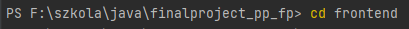
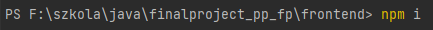
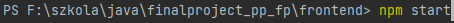
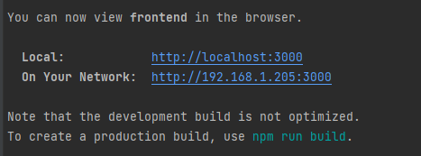

# Projekt zaliczeniowy

## Opis funkcjonalności
Aplikacja symuluje działanie kart sim typu pre paid.
  Funkcjonalności:

* zakup karty
* wykonanie połączenia telefonicznego
* wysłanie SMS'a
* sprawdzenie stanu konta
* doładowanie karty
* sprawdzenie billingu

Do uruchomienia projektu niezbędny jest uruchomiony axon server oraz baza mongodb z domyślnymi ustawieniami. 
Zaś w celu uruchomienia projektu od strony frontentowej potrzebny jest <b>node.js</b> 

###JAK WŁĄCZYĆ?

BE:  

* docker run --name axonserver -d -p 8124:8124 axoniq/axonserver
* docker run --name mongo -d -p 27017:27017 mongo
* docker exec -it mongo mongosh --quiet
* use prePaidPhone
* db.createUser({ user: "prePaidPhoneApp", pwd: "password", roles:[{role:"readWrite", db:"prePaidPhone"}]})
* exit

 
* docker stop mongo
* docker stop axonserver
* docker rm mongo
* docker rm axonserver

 FE: 

1. w terminalu przejść do katalogu ./frontend

2. w terminalu wpisać "npm install" *zostanie zaintalowana paczka react'owa*

4. w terminalu wpisać "npm run start"

Aplikacja powinna się włączyć w przeglądarce na porcie :3000  
Jeśli nie stało się to automatycznie proszę wejść w przeglądarkę i wpisać http://localhost:3000

